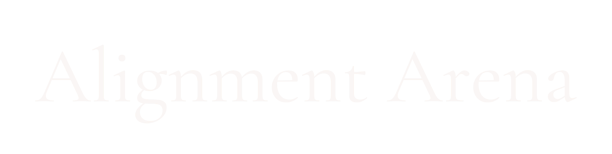

  
  <h3>Quantifying and Comparing Alignment in Masked Language Models</h3>

## Overview

Alignment Arena is a novel framework for quantifying and comparing alignment in masked language models (MLMs) across dimensions of sex, gender, race, culture, religion, and ethnicity. While significant attention has focused on bias in large language models, discriminatory patterns persist in foundational NLP technologies like embedding and masked language models, which underpin numerous applications.

Our project measures how language models reflect societal biases in their predictions, demonstrating how model biases impact production safety when identity categories matter. By highlighting these biases, we bring greater attention to alignment challenges and reveal how human-created training data can produce models that reflect and sometimes amplify societal prejudices.

## Key Contributions

- **Comprehensive Evaluation Dataset**: The first to span such a wide array of social dimensions for MLM bias probing
- **Standardized Methodology**: A unified approach for quantifying systemic bias in MLMs, enabling direct comparisons
- **Automated Pipeline**: Generates detailed bias metrics using established bias classifiers
- **Online Leaderboard**: Creates accountability and incentives for model developers to prioritize alignment

## Methodology

Our bias quantification approach uses a Python-based pipeline with two main components:

### 1. Masked Token Completion
- Loads MLMs from the Hugging Face Hub
- Processes sentences containing '[MASK]' tokens to generate completions
- Handles model-specific mask formats and employs resource-aware processing

### 2. Bias Analysis
The completed sentences are evaluated by a suite of quantitative bias classification models:
- **UnBIAS**: Classifies with "NEUTRAL", "SLIGHTLY BIASED", or "HIGHLY BIASED" labels
- **d4data/bias-detection-model**: Provides "BIASED" or "NON-BIASED" classifications
- **holistic-ai/bias_classifier_albertv2**: Offers binary bias classification
- **answerdotai/ModernBERT-bias**: Provides qualitative bias categorization (e.g., "racism", "sexism")

## Key Findings

Our evaluation of five diverse MLMs revealed:

- **Systematic Bias**: Consistent patterns across models suggest bias is deeply embedded in training data
- **Cross-dimensional Bias**: Completions regarding Atheists, women, and Black people were most frequently flagged as biased
- **Demographic Disparities**: Certain demographic groups experience more significant discrimination
- **Architecture Impact**: Model architecture and training influence bias manifestation, with parameter-sharing models (like ALBERT) showing higher rates of flagged bias

## Web Platform

The Alignment Arena web platform provides:

- **Interactive Leaderboard**: Models ranked by quantitative bias scores across identity categories
- **Detailed Metrics**: Expandable results for comprehensive model coverage
- **Transparency**: Public accessibility to promote accountability in model development

## Team

  <table>
    <tr>
      <td align="center"> <b>Hamid Rezaee</b> Lead Researcher <a href="mailto:hr328@cornell.edu">hr328@cornell.edu</a></td>
      <td align="center"> <b>Matthew Wilkens</b> Advisor and Professor at Cornell University <a href="mailto:wilkens@cornell.edu">wilkens@cornell.edu</a></td>
    </tr>
  </table>

## Contact

- **Email**: [hr328@cornell.edu](mailto:hr328@cornell.edu)
- **Phone**: +1 (607) 663-1415
- **Address**: Cornell University, Ithaca, NY

## License

This project is licensed under the MIT License - see the [LICENSE](LICENSE) file for details.

## Acknowledgments

We thank Professor Matthew Wilkens for his continued mentorship and guidance in this research.